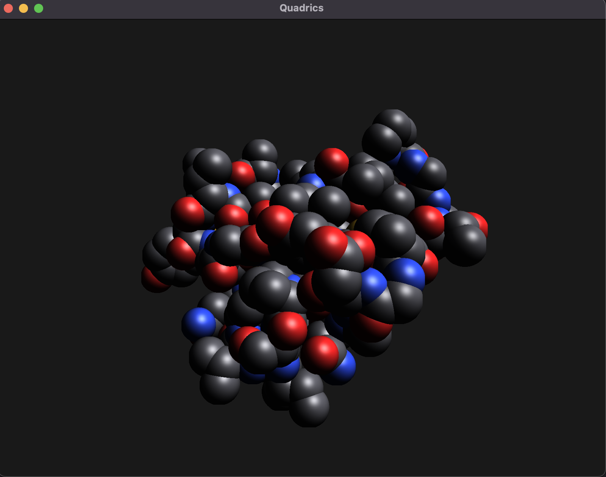
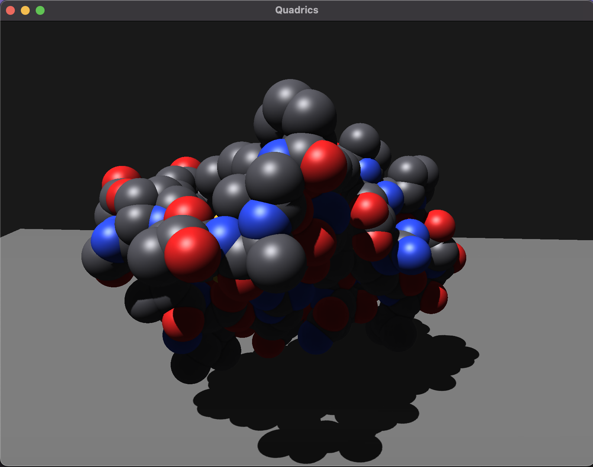
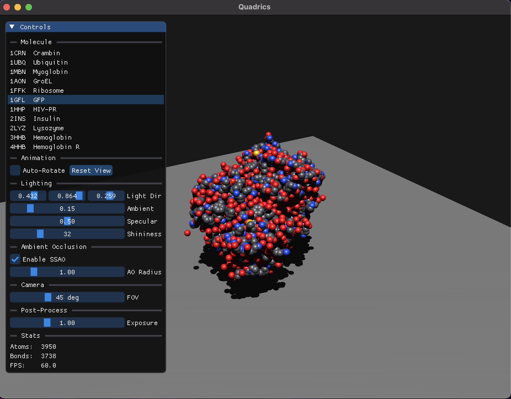

# GPU Ray-Casting of Quadric Surfaces

Real-time molecular visualiser built for the *Real-time Graphics Programming* course at **Università degli Studi di Milano**.

The renderer implements the method described in:

> Sigg, C., Weyrich, T., Botsch, M., & Gross, M. (2006).  
> **GPU-Based Ray-Casting of Quadratic Surfaces.**  
> Eurographics Symposium on Point-Based Graphics.  
> <http://reality.cs.ucl.ac.uk/projects/quadrics/pbg06.pdf>

Atoms are rendered as mathematically exact spheres and bonds as cylinders, both via GPU ray-casting. No tessellation is used — silhouettes and normals are pixel-perfect at any zoom level.

---

## Screenshots

| Deferred lighting pass | Full pipeline |
|---|---|
|  |  |



---

## Features

- **Sphere and cylinder impostors** — instanced rendering, one draw call per primitive type
- **Tight NDC bounding box** (Sigg et al., eq. 5) — exact screen-space coverage at any zoom
- **Deferred shading** — G-buffer (diffuse RGB8, normals RGB16F, depth), Blinn-Phong lighting
- **Shadow maps** — 2048×2048 depth-only FBO, PCF 3×3 soft shadows, per-impostor shadow shaders for spheres, cylinders, and ground
- **SSAO** — 16-sample hemisphere kernel, 4×4 noise rotation, box-blur pass
- **Silhouette and crease lines** — Sobel edge detection on the normal and depth G-buffer channels, togglable at runtime
- **Composite pass** — intermediate RGB16F FBO with exposure control
- **ImGui control panel** — live controls for molecule, lighting, SSAO, camera, and post-process settings
- **HiDPI / Retina support** — framebuffer size queried from GLFW, FBOs recreated on window resize
- **Automated benchmarking** — `--bench` flag records per-pass GPU times and CPU frame times to CSV for all molecules; `--bench-load` measures PDB parse and bond-detection time without opening a window

---

## Requirements

- macOS (tested on Apple Silicon and Intel)
- Xcode Command Line Tools
- [CMake](https://cmake.org/) ≥ 3.10
- [Homebrew](https://brew.sh/) packages:

```bash
brew install cmake glfw glm
```

> **No other installs needed.** [GLAD](https://glad.dav1d.de/) and [Dear ImGui](https://github.com/ocornut/imgui) are both vendored inside the repository (`external/glad/` and `external/imgui/`) and compiled automatically by CMake.

---

## Build

```bash
git clone https://github.com/OpenGL-Quadrics-Unimi/GPU-RayCasting-Quadrics.git
cd GPU-RayCasting-Quadrics
cmake -B build -S . -DCMAKE_BUILD_TYPE=Release
cmake --build build --parallel
```

The executable is placed at `build/QuadricRaycaster`.

---

## Run

```bash
cd build
./QuadricRaycaster
```

The application loads **crambin (1CRN)** by default. Use the ImGui panel to switch molecules.

---

## Controls

| Input | Action |
|---|---|
| Left-click drag | Orbit camera |
| Scroll wheel | Zoom in / out |
| ESC | Quit |

All other parameters are controlled via the **ImGui panel** (top-left corner):

| Section | Controls |
|---|---|
| **Molecule** | Switch between 11 PDB structures |
| **Animation** | Auto-rotate toggle, Reset View button |
| **Lighting** | Light direction, ambient, specular, shininess |
| **Ambient Occlusion** | Enable/disable SSAO, AO radius |
| **Camera** | Field of view |
| **Post-Process** | Exposure multiplier, Outlines toggle |
| **Stats** | Atom count, bond count, FPS |

---

## Benchmarking

The `--bench` flag runs a fully automated performance measurement: v-sync is disabled, 60 warm-up frames are discarded, and 300 frames are recorded per molecule. Results are written to a CSV file in the current directory.

```bash
# Resolution sweep (window coords; framebuffer is 2× on Retina displays)
./QuadricRaycaster --bench --w 640  --h 360  --tag full_720p
./QuadricRaycaster --bench --w 960  --h 540  --tag full_1080p
./QuadricRaycaster --bench --w 1440 --h 900  --tag full_native

# Feature ablation at 1080p
./QuadricRaycaster --bench --w 960 --h 540 --tag no_shadows  --no_shadows
./QuadricRaycaster --bench --w 960 --h 540 --tag no_ssao     --no_ssao
./QuadricRaycaster --bench --w 960 --h 540 --tag no_outlines --no_outlines
./QuadricRaycaster --bench --w 960 --h 540 --tag bare --no_shadows --no_ssao --no_outlines

# CPU-only load-time benchmark (no window required)
./QuadricRaycaster --bench-load --tag amd
```

Process the resulting CSV files into LaTeX tables and PNG plots:

```bash
python3 scripts/analyze_bench.py --machine amd   # or m3, or both
```

Pre-collected benchmark data for both machines are in `bench_data/`.

---

## Included Molecules

| PDB ID | Name | Description | Atoms | Bonds |
|---|---|---|---|---|
| 1CRN | Crambin | Small plant protein | 327 | 337 |
| 1UBQ | Ubiquitin | Cell-signalling protein | 660 | 608 |
| 1HHP | HIV-PR | HIV Protease | 758 | 771 |
| 2INS | Insulin | Hormone (dimer) | 964 | 810 |
| 2LYZ | Lysozyme | Antibacterial enzyme | 1 102 | 1 037 |
| 1MBN | Myoglobin | Oxygen-binding protein | 1 260 | 1 298 |
| 1GFL | GFP | Green Fluorescent Protein | 3 950 | 3 738 |
| 3HHB | Hemoglobin | Oxygen transport (deoxy) | 4 612 | 4 704 |
| 4HHB | Hemoglobin R | Oxygen transport (oxy) | 4 779 | 4 633 |
| 1AON | GroEL | Chaperone complex | 58 870 | 59 307 |
| 1FFK | Ribosome | Protein synthesis machine | 64 281 | 67 866 |

---

## Project Structure

```
src/
    main.cpp                        entry point, render loop, bench mode
    Core/                           Camera, Renderer
    Geometry/                       PDB parser, Bond detector
include/
    Core/                           Camera.h, Renderer.h, GpuTimer.h
    Geometry/                       PDB.h, Bonds.h, Quadric.h
shaders/
    quadric.vert / .frag            sphere impostor geometry + ray-casting
    cylinder.vert / .frag           cylinder impostor + tight NDC bbox + ray-casting
    ground.vert / .frag             ground plane (G-buffer pass)
    lighting.vert / .frag           deferred lighting + shadows + SSAO read
    ssao.frag / ssaoblur.frag       ambient occlusion + blur passes
    silhouette.frag                 Sobel edge detection on G-buffer
    composite.frag                  exposure control, final output
    shadow.frag                     depth-only pass (shared)
    shadowsphere.vert / .frag       shadow pass for sphere impostors
    shadowcylinder.vert / .frag     shadow pass for cylinder impostors
    shadowground.vert               shadow pass for ground plane
    quad.vert / .frag               fullscreen quad helper
external/
    glad/                           OpenGL loader (vendored)
    imgui/                          Dear ImGui (vendored)
data/
    *.pdb                           PDB structure files
bench_data/
    AMD/ M3/                        pre-collected CSV benchmark results
scripts/
    analyze_bench.py                generates LaTeX tables and PNG plots from CSVs
report/
    report.tex                      full implementation report
    tables/ plots/                  auto-generated by analyze_bench.py
```

---

## Authors

- **Giorgia Carboni** — project foundations, camera, PDB parser, bond detection, sphere and cylinder impostors (CPU geometry + shaders), tight NDC bounding box, ground plane, silhouette/crease-line pass, composite pass, ImGui panel, benchmark infrastructure (`GpuTimer`, `--bench`/`--bench-load` modes, analysis script)
- **Betul Gul** — deferred shading pipeline, G-buffer setup, lighting pass, shadow maps, SSAO

*Università degli Studi di Milano — Academic Year 2025–2026*
